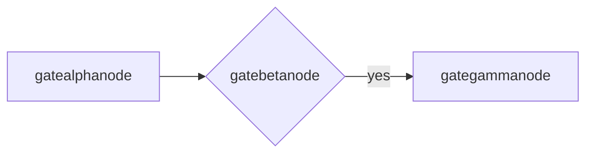
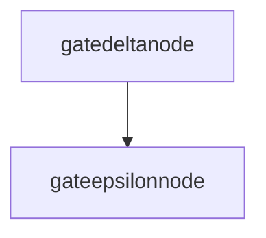
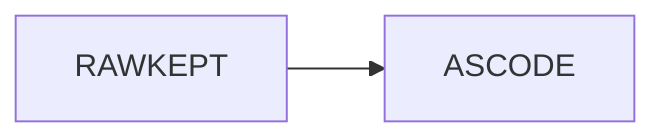

# Diagram Gate

A relative local image (CRITICAL regression: must render, not 404):


## First diagram



## Second diagram (id-collision check)



## Kept as source



## Deliberately broken

```mermaid
graph LR
  A -->
  (((
```

Done.
